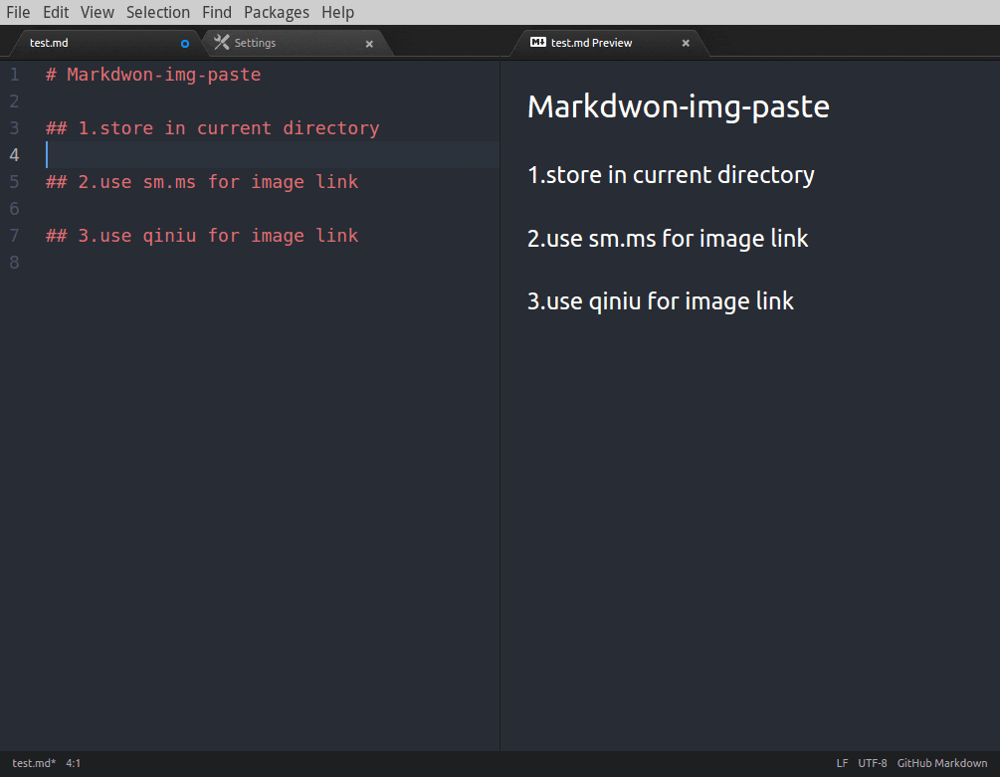

# 本工具初始化使用

markdown转pdf插件：markdown-themeable-pdf

git 工具插件:git-plus

调整左侧目录结构字体大小:
  打开styles.less    
  ```
  .tree-view {
    // background-color: whitesmoke;
    font-size:14px;
  }

  ```

  markdown-img-paste插件可以提供图片念黏贴功能。具体安装如下连接
  https://atom-china.org/t/atom-markdown/2337


## Welcome to GitHub Pages

本软件的下载地址:
 https://cnpmjs.org/mirrors/atom/1.9.9/

You can use the [editor on GitHub](https://github.com/rushwola/rushwola.github.com/edit/master/README.md) to maintain and preview the content for your website in Markdown files.

Whenever you commit to this repository, GitHub Pages will run [Jekyll](https://jekyllrb.com/) to rebuild the pages in your site, from the content in your Markdown files.

### Markdown

Markdown is a lightweight and easy-to-use syntax for styling your writing. It includes conventions for

```markdown
Syntax highlighted code block

# Header 1
## Header 2
### Header 3

- Bulleted
- List

1. Numbered
2. List

**Bold** and _Italic_ and `Code` text

[Link](url) and 
```

For more details see [GitHub Flavored Markdown](https://guides.github.com/features/mastering-markdown/).

### Jekyll Themes

Your Pages site will use the layout and styles from the Jekyll theme you have selected in your [repository settings](https://github.com/rushwola/rushwola.github.com/settings). The name of this theme is saved in the Jekyll `_config.yml` configuration file.

### Support or Contact

Having trouble with Pages? Check out our [documentation](https://help.github.com/categories/github-pages-basics/) or [contact support](https://github.com/contact) and we’ll help you sort it out.


###  others

http://www.aiuxian.com/article/p-1802736.html

http://www.cnblogs.com/fnng/archive/2012/08/14/2637279.html





# 什么是Markdown
网上资料。
https://www.appinn.com/markdown/

什么是 Markdown？简单地说，它就是一种语法，一门适合用于写作的简单语言。用过 Markdown 的人都知道，它的高效在于能有效避免不规范的行高、行距、首行缩紧等格式要求，
以及繁乱复杂的字体，这样用户就能专注于写作本身，抛开杂项带来的烦恼。如果你从来没用过 Markdown，那我可以非常明确地告诉你——学习入门级的 Markdown 用法只需要
10 分钟，就足够了！


Atom github出的编辑器；功能十分强大，支持各种编程语言；安装后会在添加右键菜单，图标丑；全平台，程序猿专用

# atom使用Markdown图片元素

markdown-img-paste插件可以提供图片念黏贴功能。具体安装如下连接
https://atom-china.org/t/atom-markdown/2337
