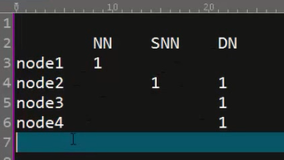

# hdfs 完全分布式搭建

机器规划


1. 时间同步,网络免密码登录(namenode到所有的datanode,此处为node1==>node1-4),修改hosts文件,防火墙关闭

```
设置主机名:
vim /etc/sysconfig/network
vim /etc/hosts

安装时间同步
yum install ntp -y
ntpdate -u cn.pool.ntp.org

防火墙关闭
/etc/init.d/iptables stop
setenforce 0

免密码登录(node01=>node01,node01=>node01-04)
在node01上执行:
ssh-keygen -t rsa
ssh-copy-id -i ~/.ssh/id_rsa.pub node01
ssh-copy-id -i ~/.ssh/id_rsa.pub node02
ssh-copy-id -i ~/.ssh/id_rsa.pub node03
ssh-copy-id -i ~/.ssh/id_rsa.pub node04
```

2. 安装jdk
3. 上传安装文件,解压
4. 修改配置文件
    hadoop-env.sh 中的JAVA_HOME:
    ```
    export JAVA_HOME=/opt/jdk1.8.0_191

    ```
    core-site.xml
    ```
    <configuration>
    	<property>
    		<name>hadoop.tmp.dir</name>
    		<value>/opt/hadoop</value>
    	</property>
    	<property>
    		<name>fs.default.name</name>
    		<value>hdfs://node01:9000</value>
    	</property>
   </configuration>

    ```
    hdfs-site.xml
    ```
    <configuration>
    	<property>
    		<name>dfs.replication</name>
    		<value>3</value>
    	</property>
      <property>
        <name>dfs.namenode.secondary.http-address</name>
        <value>node02:50090</value>
      </property>
  </configuration>

    ```
    slaves 指定datanode
    ```
    node02
    node03
    node04
    ```
    手动创建masters 指家SNN
    ```
    node02
    ```
5. 同步配置文件,保证集群每台服务器配置都相同
6. 格式化namenode hdfs namenode -format
7. 启动 start-dfs.sh


错误:
```
2018-11-21 05:36:15,187 FATAL org.apache.hadoop.hdfs.server.datanode.DataNode: Exception in secureMain
java.net.UnknownHostException: bogon: bogon: Name or service not known
	at java.net.InetAddress.getLocalHost(InetAddress.java:1506)
	at org.apache.hadoop.security.SecurityUtil.getLocalHostName(SecurityUtil.java:187)
	at org.apache.hadoop.security.SecurityUtil.login(SecurityUtil.java:207)
	at org.apache.hadoop.hdfs.server.datanode.DataNode.instantiateDataNode(DataNode.java:2217)
	at org.apache.hadoop.hdfs.server.datanode.DataNode.createDataNode(DataNode.java:2266)
	at org.apache.hadoop.hdfs.server.datanode.DataNode.secureMain(DataNode.java:2442)
	at org.apache.hadoop.hdfs.server.datanode.DataNode.main(DataNode.java:2466)
Caused by: java.net.UnknownHostException: bogon: Name or service not known
	at java.net.Inet4AddressImpl.lookupAllHostAddr(Native Method)
	at java.net.InetAddress$2.lookupAllHostAddr(InetAddress.java:929)
	at java.net.InetAddress.getAddressesFromNameService(InetAddress.java:1324)
	at java.net.InetAddress.getLocalHost(InetAddress.java:1501)
	... 6 more

这是由于hostname没有设置成功的原因,要重新设置hostname
```

执行命令时报错:
```
18/11/22 06:50:29 WARN util.NativeCodeLoader: Unable to load native-hadoop library for your platform... using builtin-java classes where applicable

```

原因可能是hadoop的预编译包与操作系统的不一致,比如hadoop的预编译包是32bit的而linux是64位.
我可以检查一下:
```
进入hadoop的lib/native目录
ldd libhadoop.so.1.0.0

./libhadoop.so.1.0.0: /lib64/libc.so.6: version `GLIBC_2.14' not found (required by ./libhadoop.so.1.0.0)
	linux-vdso.so.1 =>  (0x00007fff705e3000)
	libdl.so.2 => /lib64/libdl.so.2 (0x00007f41dba8c000)
	libc.so.6 => /lib64/libc.so.6 (0x00007f41db6f7000)
	/lib64/ld-linux-x86-64.so.2 (0x0000003724200000)

可见原来系统预装的glibc库是2.12版本，而hadoop期望是2.14版本，所以打印警告信息.

```

解决方法:安装glibc2.14

下载地址:http://ftp.gnu.org/gnu/glibc/
具体操作可看:https://www.cnblogs.com/erygreat/p/7223829.html;


# ha namenode

机器规划


1. 时间同步,jdk,修改hosts文件,防火墙关闭

2. 网络免密码登录

node01到 node01-04
node02 到 node01-04
两台NN 之间也要做免密钥登录
```
在node02上运行:
ssh-keygen -t rsa
ssh-copy-id -i ~/.ssh/id_rsa.pub node01
ssh-copy-id -i ~/.ssh/id_rsa.pub node03
ssh-copy-id -i ~/.ssh/id_rsa.pub node04

```

3. 安装zookeeper

```
分别在node01,node02,node03三个节点上安装zookeeper
然后分别在三台机器上启动zk

```

4. 修改配置文件

```
1.x当中创建的masters文件一定要保证每台服务器都删除.

删除hadoop以前存放数据的文件,现在是:/opt/hadoop


```

修改hdfs-site.xml
```
<configuration>
	<property>
  		<name>dfs.replication</name>
    		<value>3</value>
    	</property>
    	<property>
    		<name>dfs.nameservices</name>
    	       <value>mycluster</value>
    	</property>
	<property>
	  	<name>dfs.ha.namenodes.mycluster</name>
	    	<value>nn1,nn2</value>
	</property>
	<property>
	  	<name>dfs.namenode.rpc-address.mycluster.nn1</name>
	    	<value>node01:8020</value>
	</property>
	<property>
	      	<name>dfs.namenode.rpc-address.mycluster.nn2</name>
	        <value>node02:8020</value>
	</property>
	<property>
	  	<name>dfs.namenode.http-address.mycluster.nn1</name>
	    	<value>node01:50070</value>
	</property>
	<property>
	      	<name>dfs.namenode.http-address.mycluster.nn2</name>
	        <value>node02:50070</value>
	</property>
	<property>
	  	<name>dfs.namenode.shared.edits.dir</name>
	    	<value>qjournal://node02:8485;node03:8485;node04:8485/mycluster</value>
	</property>
	<property>
	  	<name>dfs.client.failover.proxy.provider.mycluster</name>
	    	<value>org.apache.hadoop.hdfs.server.namenode.ha.ConfiguredFailoverProxyProvider</value>
	</property>
	<property>
	  	<name>dfs.ha.fencing.methods</name>
	    	<value>sshfence</value>
	</property>
	<property>
  		<name>dfs.ha.fencing.ssh.private-key-files</name>
    		<value>/home/root/.ssh/id_rsa</value>
    	</property>
    	<property>
    	  	<name>dfs.journalnode.edits.dir</name>
    	    	<value>/path/to/journal/node/local/data</value>
    	</property>
</configuration>


```


core-site.xml:
```
<configuration>
	<property>
		<name>fs.default.name</name>
		<value>hdfs://mycluster</value>
	</property>
	<property>
	        <name>hadoop.tmp.dir</name>
	        <value>/opt/hadoop</value>
	</property>

</configuration>

```

5. 同步所有的配置文件到node01-04

6. 启动

分别在node02,node03,node04启动JournalNodes
```
hadoop-daemon.sh  start journalnode

```

格式化namenode,先在一台机器上执行,比如在node01
```
hdfs namenode -format

```

将node01上的namenode的元数据拷贝到另一台namenode上(node02)
```
hdfs namenode -bootstrapStandby

发现报错
18/11/23 20:05:36 FATAL ha.BootstrapStandby: Unable to fetch namespace information from active NN at node01/192.168.152.3:8020: Call From node02/192.168.152.4 to node01:8020 failed on connection exception: java.net.ConnectException: Connection refused; For more details see:  http://wiki.apache.org/hadoop/ConnectionRefused

原因是因为node01上的namenode服务没有启动,所以一直连接失败,只要将node01上的namenode服务启动即可.

在node01在node01上启动namenode

hadoop-daemon.sh  start namenode
```

格式化zookeeper

```
hdfs zkfc -formatZK

```

启动hdfs
```
start-dfs.sh

```
