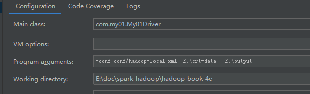
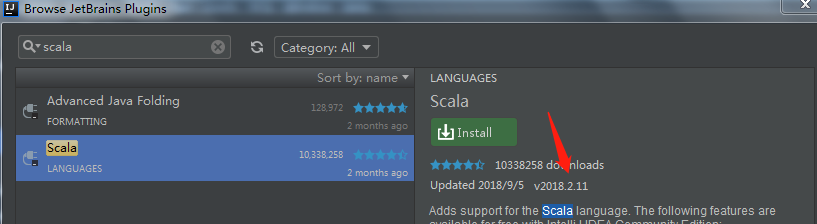
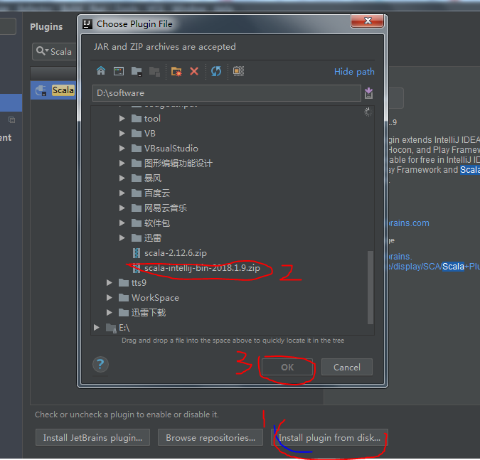

# 软件下载

从http://www.jetbrains.com/下载社区版本即可。
https://mirrors.tuna.tsinghua.edu.cn/apache/
#  IDEA community社区版集成tomcat

虽然IntelliJ IDEA社区版没有自带tomcat。
但是我们可以装一个插件——smart tomcat。

安装　smart tomcat 插件，然后 重启IDEA。

然后 Run >> Edit Configurations >> 填写如下几项：

Name：配置的名字，随便起。一般就用项目名
Tomcat Server：tomcat的路径
Deployment：webapp所在的路径
Contex Path：上下文路径。会自己识别出来，一般我们不改这个。
Server Port：默认是8080，可以改成其它
VM options: 可选的。没有参数就不填

但是社区版本热部署web项目找不到解决方案。

# 专业版本

专业版的破解方法:
https://www.cnblogs.com/jpfss/p/8872358.html

# idea 设置hadoop程序本地运行

代码如下:

```
package com.my01;


import org.apache.hadoop.conf.Configuration;
import org.apache.hadoop.conf.Configured;
import org.apache.hadoop.fs.Path;
import org.apache.hadoop.io.IntWritable;
import org.apache.hadoop.io.LongWritable;
import org.apache.hadoop.io.Text;
import org.apache.hadoop.mapreduce.Job;
import org.apache.hadoop.mapreduce.Mapper;
import org.apache.hadoop.mapreduce.Reducer;
import org.apache.hadoop.mapreduce.lib.input.FileInputFormat;
import org.apache.hadoop.mapreduce.lib.input.TextInputFormat;
import org.apache.hadoop.mapreduce.lib.output.FileOutputFormat;
import org.apache.hadoop.mapreduce.lib.output.TextOutputFormat;
import org.apache.hadoop.util.Tool;
import org.apache.hadoop.util.ToolRunner;

import java.io.IOException;
import java.util.Map;
import java.util.StringTokenizer;

public class My01Driver extends Configured implements Tool {


    public static class WordCountMap extends
            Mapper<LongWritable, Text, Text, IntWritable> {

        private final IntWritable one = new IntWritable(1);
        private Text word = new Text();

        public void map(LongWritable key, Text value, Context context)
                throws IOException, InterruptedException {
            String line = value.toString();
            StringTokenizer token = new StringTokenizer(line);
            while (token.hasMoreTokens()) {
                word.set(token.nextToken());
                context.write(word, one);
            }
        }
    }


    public static class WordCountReduce extends
            Reducer<Text, IntWritable, Text, IntWritable> {

        public void reduce(Text key, Iterable<IntWritable> values,
                           Context context) throws IOException, InterruptedException {
            int sum = 0;
            for (IntWritable val : values) {
                sum += val.get();
            }
            context.write(key, new IntWritable(sum));
        }
    }

    @Override
    public int run(String[] args) throws Exception {

        if (args.length != 2) {
            System.err.printf("Usage: %s [generic options] <input> <output>\n",
                    getClass().getSimpleName());
            ToolRunner.printGenericCommandUsage(System.err);
            return -1;
        }

        //将jab 所用的参数都打印出来
        Configuration conf = getConf();
        for (Map.Entry<String, String> entry : conf) {
            System.out.printf("%s=%s\n", entry.getKey(), entry.getValue());
        }

        Job job = new Job(conf);
        job.setJarByClass(My01Driver.class);
        job.setJobName("My01Driver");

        job.setOutputKeyClass(Text.class);
        job.setOutputValueClass(IntWritable.class);


        job.setMapperClass(WordCountMap.class);
        job.setReducerClass(WordCountReduce.class);

        job.setInputFormatClass(TextInputFormat.class);
        job.setOutputFormatClass(TextOutputFormat.class);

        FileInputFormat.addInputPath(job, new Path(args[0]));
        FileOutputFormat.setOutputPath(job, new Path(args[1]));


        return(job.waitForCompletion(true)?0:-1);
    }

    public static void main(String[] args) throws Exception {
        int exitCode = ToolRunner.run(new My01Driver(), args);
        System.exit(exitCode);

//        My01Driver  myo1=new My01Driver();
//        myo1.setConf(new Configuration());
//        GenericOptionsParser parser = new GenericOptionsParser(
//                myo1.getConf(), args);
//        String[] toolArgs = parser.getRemainingArgs();
//        for(String arg:toolArgs){
//            System.out.println(arg);
//        }

    }
}


```

jvm运行参数设置如图：



其中-conf conf/hadoop-local.xml设置了hadoop本地运行。
接着后面两个路径分别设置了input和output路径。

结果运行报错:

```

Exception in thread "main" java.lang.NullPointerException
	at java.lang.ProcessBuilder.start(ProcessBuilder.java:1010)
	at org.apache.hadoop.util.Shell.runCommand(Shell.java:482)
	at org.apache.hadoop.util.Shell.run(Shell.java:455)
	at org.apache.hadoop.util.Shell$ShellCommandExecutor.execute(Shell.java:715)
	at org.apache.hadoop.util.Shell.execCommand(Shell.java:808)
	at org.apache.hadoop.util.Shell.execCommand(Shell.java:791)
	at org.apache.hadoop.fs.RawLocalFileSystem.setPermission(RawLocalFileSystem.java:656)
	at org.apache.hadoop.fs.RawLocalFileSystem.mkdirs(RawLocalFileSystem.java:444)
	at org.apache.hadoop.fs.FilterFileSystem.mkdirs(FilterFileSystem.java:293)
	at org.apache.hadoop.mapreduce.JobSubmissionFiles.getStagingDir(JobSubmissionFiles.java:133)
	at org.apache.hadoop.mapreduce.JobSubmitter.submitJobInternal(JobSubmitter.java:437)
	at org.apache.hadoop.mapreduce.Job$10.run(Job.java:1296)
	at org.apache.hadoop.mapreduce.Job$10.run(Job.java:1293)
	at java.security.AccessController.doPrivileged(Native Method)
	at javax.security.auth.Subject.doAs(Subject.java:415)
	at org.apache.hadoop.security.UserGroupInformation.doAs(UserGroupInformation.java:1628)
	at org.apache.hadoop.mapreduce.Job.submit(Job.java:1293)
	at org.apache.hadoop.mapreduce.Job.waitForCompletion(Job.java:1314)
	at com.my01.My01Driver.run(My01Driver.java:95)
	at org.apache.hadoop.util.ToolRunner.run(ToolRunner.java:70)
	at org.apache.hadoop.util.ToolRunner.run(ToolRunner.java:84)
	at com.my01.My01Driver.main(My01Driver.java:99)

```
原因分析：缺少hadoop.dll或winutils.exe

方法：下载hadoop_dll2.6.0_64bit.zip并解压，
用-Dhadoop.home.dir=E:\soft\hadoop_dll2.6.0_64bit指定hadoop路径。

但用这种方法，最后还是不行，老是报如下错误:
```
Exception in thread "main" java.lang.UnsatisfiedLinkError: org.apache.hadoop.io.nativeio.NativeIO$Windows.access0(Ljava/lang/String;I)Z
	at org.apache.hadoop.io.nativeio.NativeIO$Windows.access0(Native Method)
	at org.apache.hadoop.io.nativeio.NativeIO$Windows.access(NativeIO.java:557)
	at org.apache.hadoop.fs.FileUtil.canRead(FileUtil.java:977)
	at org.apache.hadoop.util.DiskChecker.checkAccessByFileMethods(DiskChecker.java:187)
	at org.apache.hadoop.util.DiskChecker.checkDirAccess(DiskChecker.java:174)
	at org.apache.hadoop.util.DiskChecker.checkDir(DiskChecker.java:108)
	at org.apache.hadoop.fs.LocalDirAllocator$AllocatorPerContext.confChanged(LocalDirAllocator.java:285)
	at org.apache.hadoop.fs.LocalDirAllocator$AllocatorPerContext.getLocalPathForWrite(LocalDirAllocator.java:344)
	at org.apache.hadoop.fs.LocalDirAllocator.getLocalPathForWrite(LocalDirAllocator.java:150)
	at org.apache.hadoop.fs.LocalDirAllocator.getLocalPathForWrite(LocalDirAllocator.java:131)
	at org.apache.hadoop.fs.LocalDirAllocator.getLocalPathForWrite(LocalDirAllocator.java:115)
	at org.apache.hadoop.mapred.LocalDistributedCacheManager.setup(LocalDistributedCacheManager.java:131)
	at org.apache.hadoop.mapred.LocalJobRunner$Job.<init>(LocalJobRunner.java:163)
	at org.apache.hadoop.mapred.LocalJobRunner.submitJob(LocalJobRunner.java:731)
	at org.apache.hadoop.mapreduce.JobSubmitter.submitJobInternal(JobSubmitter.java:536)
	at org.apache.hadoop.mapreduce.Job$10.run(Job.java:1296)
	at org.apache.hadoop.mapreduce.Job$10.run(Job.java:1293)
	at java.security.AccessController.doPrivileged(Native Method)
	at javax.security.auth.Subject.doAs(Subject.java:415)
	at org.apache.hadoop.security.UserGroupInformation.doAs(UserGroupInformation.java:1628)
	at org.apache.hadoop.mapreduce.Job.submit(Job.java:1293)
	at org.apache.hadoop.mapreduce.Job.waitForCompletion(Job.java:1314)
	at com.my01.My01Driver.run(My01Driver.java:92)
	at org.apache.hadoop.util.ToolRunner.run(ToolRunner.java:70)
	at org.apache.hadoop.util.ToolRunner.run(ToolRunner.java:84)
	at com.my01.My01Driver.main(My01Driver.java:96)

```

最后无法，找到一种修改源码的办法:
修改:org.apache.hadoop.io.nativeio.NativeIO源码
在项目工程里面新建org.apache.hadoop.io.nativeio.NativeIO类。修改access方法:
```
public static boolean access(String path, AccessRight desiredAccess)
               throws IOException {
//            return access0(path, desiredAccess.accessRight());
           return true;
       }

```

最后发现没有日志输出，如果想要日志输出，需要自己添加log4j.properties文件。


 注意在开发hadoop的时侯我们可以通过配置HADOOP_USER_NAME环境变量来指定访问hdfs文件的用户.

#　idea 安装scala 插件

首先找到软件里面匹配的Scala版本


插件下载地址:
 http://plugins.jetbrains.com/plugin/1347-scala
找到对应的插件版本，然后下载。

 直接可用，如下图File——settings——plugins点击“Install plugin from disk”

 


 https://blog.csdn.net/gx304419380/article/details/80245976
