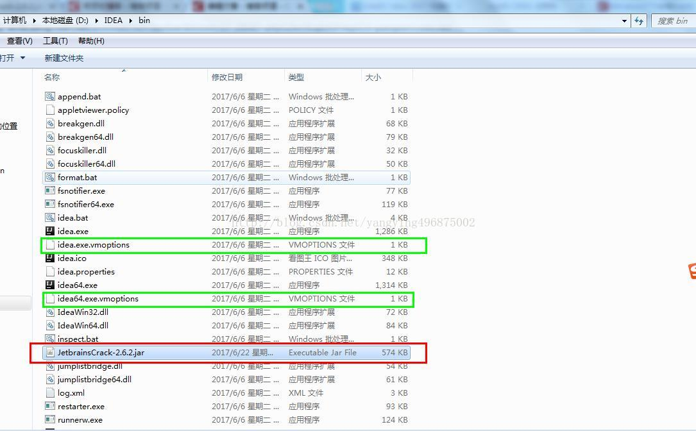
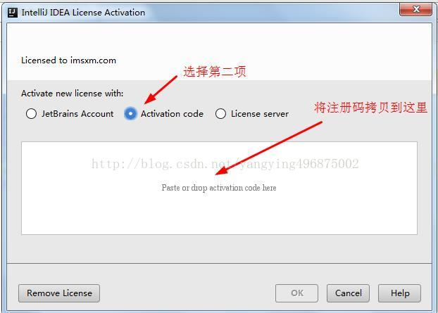

1:把JetbrainsCrack-3.1-release-enc.jar这个jar包放到IDEA的安装目录下

2.将你下载好的JetbrainsCrack-2.6.2.jar拷贝到你的Idea安装目录的bin目录下,如下图红色框所示


3.在安装的idea下面的bin目录下面有2个文件 ： 一个是idea64.exe.vmoptions，还有一个是idea.exe.vmoptions（如上图绿框）。

用记事本打开 分别在最下面一行增加一行：-javaagent:D:\IDEA\bin\JetbrainsCrack-2.6.2.jar

注意:“D:\IDEA\bin\JetbrainsCrack-2.6.2.jar”是我对应的JetbrainsCrack-2.6.2.jar的位置,你用你自己的安装路径。

4.重新启动软件,再到Acrivation code中选择界面的时候,写入下面注册代码(到2099年到期)
```
ThisCrackLicenseId-{    
"licenseId":"ThisCrackLicenseId",    
"licenseeName":"idea",    
"assigneeName":"",    
"assigneeEmail":"idea@163.com",    
"licenseRestriction":"For This Crack, Only Test! Please support genuine!!!",    
"checkConcurrentUse":false,    
"products":[    
{"code":"II","paidUpTo":"2099-12-31"},    
{"code":"DM","paidUpTo":"2099-12-31"},    
{"code":"AC","paidUpTo":"2099-12-31"},    
{"code":"RS0","paidUpTo":"2099-12-31"},    
{"code":"WS","paidUpTo":"2099-12-31"},    
{"code":"DPN","paidUpTo":"2099-12-31"},    
{"code":"RC","paidUpTo":"2099-12-31"},    
{"code":"PS","paidUpTo":"2099-12-31"},    
{"code":"DC","paidUpTo":"2099-12-31"},    
{"code":"RM","paidUpTo":"2099-12-31"},    
{"code":"CL","paidUpTo":"2099-12-31"},    
{"code":"PC","paidUpTo":"2099-12-31"}    
],    
"hash":"2911276/0",    
"gracePeriodDays":7,    
"autoProlongated":false}   

```


