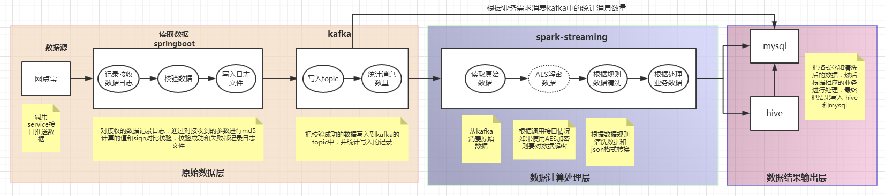
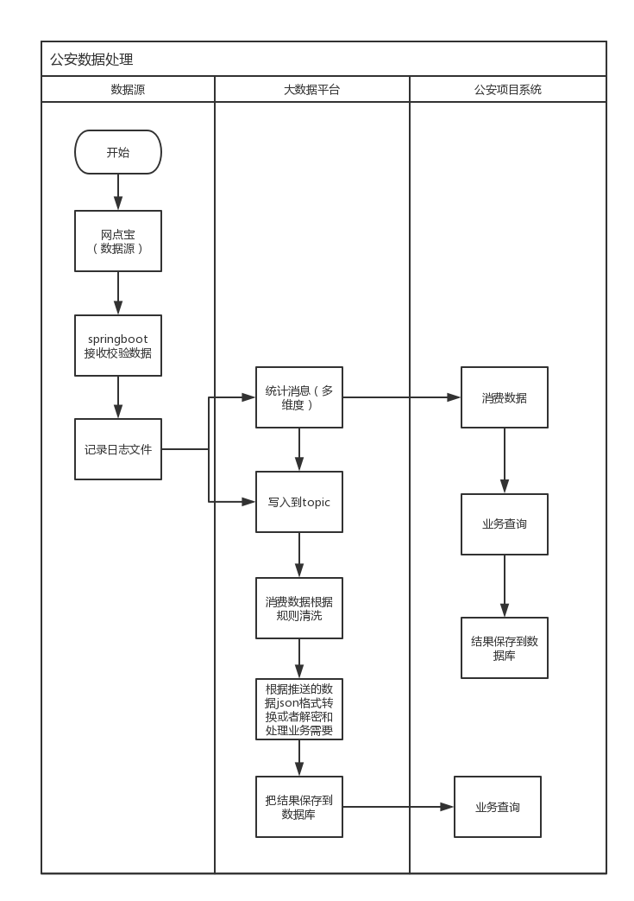

对外提供的方案（离线业务）：

1、提供一个写入接口，接收数据，数据量不超过500条，只支持post
2、提供一个写入接口，接收数据，数据量不超过500条，只支持post（data中的数据需要进行 AES 加密）
3、提供一个读取接口，返回《前一天 00:00 - 23:59》接收到的数据总量统计，支持get和post
4、提供一个读取接口，接收参数为ID（UUID值），返回该ID的数据接收情况，支持get和post

4、提供一个http接口，接收文件（下一阶段提供）
5、提供一个读取接口，接收参数为开始日期，结束日期，返回开始、结束日期内的接收数据统计，支持get和post（下一阶段提供）

---------------------------------------------------------------------------------------------------------------

用户需要提交的参数：
1、UUID（String), 具有唯一性，用来识别这条数据
2、type：(int) 表示属于哪个业务
3、时间：(String)粒度：毫秒级
4、data：(String)业务数据，json格式（采用 AES 进行对称加密，服务端接收后，进行解密）
5、clientId：(String)客户端标识
6、sign：(String)参数签名，md5

{
	uuid:"xxxxxxxxxx",
	type:"1111",
	timestamp:"2018-05-11 12:23:15.987",
	data:{json格式的用户数据},
	clientId:1
	sign:"md5值"
}

给客户端的响应参数：
code	int		响应码，参见请求响应码定义部分
msg	string		响应消息，与code字段配对出现
data	json		响应的数据

---------------------------------------------------------------------------------------------------------------

---------------------------------------------------------------------------------------------------------------

内部处理方案：

1、接收到数据后，打印一条日志信息到日志文件，包括ID，md5值等（info级）
2、对data（用户数据）进行AES解密，然后计算md5值，和sign值进行比对，如果比对失败，则返回验证数据完整性失败的信息，同时把验证失败信息打印到日志文件，并向kafka提交一条验证失败的统计信息
3、数据完整性验证成功，则提交数据给kafka，提交数据成功后，向客户端返回成功状态，并打印成功日志
4、数据提交到kafka成功后（业务用的topic），提交一条统计信息到kafka（统计用的topic）。（统计信息先缓存在本地，每秒提交一次，降低并发压力）

kafka消费者（数据处理业务）：

1、使用 spark-streaming 从kafka消费数据
2、解析json数据，对data进行AES解密
3、根据业务对data数据进行处理
	1）把json数据转换为格式化的数据
	2）对格式化后的数据，根据相应的业务进行处理，然后把最终结果写入 hive和mysql

kafka消费者（统计信息）：
1、创建一个独立的WEB项目，消费kafka中的统计信息，进行相应的业务处理，然后把统计结果写入mysql

图片:

