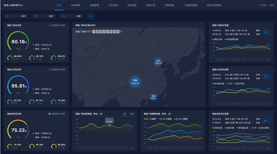

# 需求



各设备的消息事件定义：（切换到小类，则显示不同的消息类别）
1. 智能水表： 离线事件、 上线事件、 当日用水量过大事件（>3m³）、连续7日无用水事件（日度仅报1次）-- 当第n天， 及第（n-6）天有读数且读数为正的情况下才执行“连续7日无用水”的判断；其他情况不做判断

2. 热水表：离线事件、 上线事件、 当日热水用量过高（>0.5m³）

3. 智能电表： 离线事件、上线事件、合闸事件、拉闸事件、当日用电量过高（>10kWh）（日度仅报1次）、连续7日无用电事件（日度仅报1次）-- 当第n天， 及第（n-6）天有读数且读数为正数的情况下才执行“连续7日无用电”的判断；其他情况不做判断
4. 采集网关（水表、电表的采集网关）： 离线事件、上线事件
5. 智能门锁：离线事件、上线事件、低电事件（日度仅报1次）
6. 门锁网关：离线事件、上线事件


# 统计指标

１. 智能门锁开锁热力图(周期1-10秒)
　　统计维度:项目、城市、省份
    locker_operation_record一条记录表示一次开锁
2. 智能门锁累计开锁次数：
    各项目上线门锁业务以来的所有开锁次数的合计
    locker_operation_record一条记录表示一次开锁

３. 智能门锁实时
    消息:
        离线告警
        --elasticsearch
        低电告警
        --elasticsearch    
    随机两条消息放在redis里面

    智能门锁离线和低电量：locker_status_record.log文件，status字段记录状态类型，
    onLine在线/offLine离线/lowBattery底电量。

４. 智能水表实时告警

    消息:
        拉闸告警
        --elasticsearch
        合闸告警
        --elasticsearch
        当日用水量过高告警
        --elasticsearch
        当日大于７日首次用水告警
        --elasticsearch
    随机两条消息放在redis里面


    water_data_record.log ，查表记录，readRecord用水量。

5. 智能电表实时告警
    消息
        拉闸告警
        --elasticsearch
        合闸告警
        --elasticsearch
        当日用电量过高告警
        --elasticsearch
        当日大于７日首次用电告警
        --elasticsearch
    随机两条消息放在redis里面

    elec_data_record.log用电量、elec_operation_record.log电表操作,ElecSwitchOn 合闸 ElecSwitchOff拉闸,bind(绑定)/unBind(解绑)/upgrade(升级)
#　redis 设计

* 智能门锁累计开锁次数：　
    qdh_ufo_lockerOpenCountsTotal_tenantId:xxx_cityCode:xxxxx_projectId:xxxxx
* 智能门锁开锁热力图:
  qdh_ufo_lockerOpenCounts_tenantId:xxx_cityCode:xxxxx_projectId:xxxxx_时间戳

* 智能门禁累计通行次数
qdh_ufo_sentryPassCounts_tenantId:xxx_cityCode:xxxxx_projectId:xxxxx

* 智能门禁累计用户数
qdh_ufo_sentryUserCounts_tenantId:xxx_cityCode:xxxxx_projectId:xxxxx

* 智能门禁通行实时热力图
qdh_ufo_sentryPassTimeCounts_tenantId:xxx_cityCode:xxxxx_projectId:xxxxx_时间戳


#　es结构

```
{
	"project": "gy_sys",
	"input_time": "2018-07-11 15:48:24",
	"data": {
		"provinceCode": "35",
		"provinceName": "中陲省",
		"cityCode": "23",
		"cityName": "中陲",
		"projectId": "04c1adb0dc344b3db76ec72134bd23bc",
		"projectName": "千丁-嘉园",
		"buildId": "57def1776c8b4e63b13b8f20aa49d11f",
		"buildName": "2栋",
		"unitId": "3ee4d3e610174283ad0d7b662380b388",
		"unitName": "1单元",
		"roomId": "272dd920ba8c4860bdcfbb1966a8b02f",
		"roomName": "101",
		"sn": "",
		"deviceCode": "",
		"deviceName": "",
		"recordTime": "2018-07-11 15:48:24",
		"content":"操作内容",
		"eventType":"" 	offline  离线
							online   上线
							lowBattery	低电量
							addPwd 		下发密码
							swithOff 	拉闸
							swithOn		合闸
							overUsingWatter	用水量过高
							7UsingWatter	大于7日首次用水
							7UsingElectricity	大于7日首次用电
							overUsingElectricity	用电量过高

		"tenantId":"",
		"manufacturerId":"",
		"manufacturerName":""
		"deviceType": "",    smart_locker  智能门锁
							 locker_gateway  门锁网关
							 smart_water_meter 智能水表
							 hot_water_meter 热水表
							 smart_electric_meter  智能电表
							 采集网关
	},
	"business": "gy_device_events"
}

告警类型:
offline  离线
online   上线
lowBattery        低电量
addPwd            下发密码
swithOff 拉闸
swithOn             合闸
overUsingWatter      用水量过高
7UsingWatter  大于7日首次用水
7UsingElectricity     大于7日首次用电
overUsingElectricity        用电量过高

设备类型:
smart_locker 智能门锁
locker_gateway  门锁网关
smart_water_meter 智能水表
smart_electric_meter 智能电表
hot_water_meter 热水表
meter_gateway 水电表网关

```


# 随机告警

```
[
	{'time': '15:22:16','cityName': '北京','projectName': '富力花园', 'position': '1栋201', 'eventType': '离线'},
	{'time': '15:22:16','cityName': '北京','projectName': '富力花园', 'position': '1栋201', 'eventType': '离线'}
]

```
