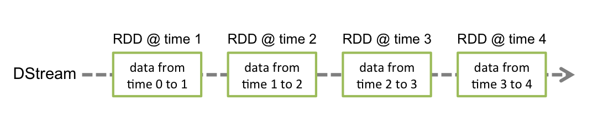

# 简介

Spark的优势在于内存计算，然而在计算中难免会用到一些元数据或中间数据，有的存在关系型数据库中，有的存在HDFS上，有的存在HBase中，但其读写速度都和Spark计算的速度相差甚远，而Redis基于内存的读写则可以完美解决此类问题，下面介绍Spark如何与Redis交互。
在Spark计算的时候如何加载Redis中的数据，其实官方有现成的包和文档，文档是全英文，好在东西不多，下面介绍如何使用。

基于Spark通用计算平台，可以很好地扩展各种计算类型的应用，尤其是Spark提供了内建的计算库支持，像Spark Streaming、Spark SQL、MLlib、GraphX，这些内建库都提供了高级抽象，可以用非常简洁的代码实现复杂的计算逻辑、这也得益于Scala编程语言的简洁性。这里，我们基于1.3.0版本的Spark搭建了计算平台，实现基于Spark Streaming的实时计算。
我们的应用场景是分析用户使用手机App的行为，描述如下所示：

* 手机客户端会收集用户的行为事件（我们以点击事件为例），将数据发送到数据服务器，我们假设这里直接进入到Kafka消息队列
* 后端的实时服务会从Kafka消费数据，将数据读出来并进行实时分析，这里选择Spark Streaming，因为Spark Streaming提供了与Kafka整合的内置支持
* 经过Spark Streaming实时计算程序分析，将结果写入Redis，可以实时获取用户的行为数据，并可以导出进行离线综合统计分析

# Spark Streaming介绍

Spark Streaming提供了一个叫做DStream（Discretized Stream）的高级抽象，DStream表示一个持续不断输入的数据流，可以基于Kafka、TCP Socket、Flume等输入数据流创建。在内部，一个DStream实际上是由一个RDD序列组成的。Sparking Streaming是基于Spark平台的，也就继承了Spark平台的各种特性，如容错（Fault-tolerant）、可扩展（Scalable）、高吞吐（High-throughput）等。
在Spark Streaming中，每个DStream包含了一个时间间隔之内的数据项的集合，我们可以理解为指定时间间隔之内的一个batch，每一个batch就构成一个RDD数据集，所以DStream就是一个个batch的有序序列，时间是连续的，按照时间间隔将数据流分割成一个个离散的RDD数据集，如图所示（来自官网）：



我们都知道，Spark支持两种类型操作：Transformations和Actions。Transformation从一个已知的RDD数据集经过转换得到一个新的RDD数据集，这些Transformation操作包括map、filter、flatMap、union、join等，而且Transformation具有lazy的特性，调用这些操作并没有立刻执行对已知RDD数据集的计算操作，而是在调用了另一类型的Action操作才会真正地执行。Action执行，会真正地对RDD数据集进行操作，返回一个计算结果给Driver程序，或者没有返回结果，如将计算结果数据进行持久化，Action操作包括reduceByKey、count、foreach、collect等。关于Transformations和Actions更详细内容，可以查看官网文档。
同样、Spark Streaming提供了类似Spark的两种操作类型，分别为Transformations和Output操作，它们的操作对象是DStream，作用也和Spark类似：Transformation从一个已知的DStream经过转换得到一个新的DStream，而且Spark Streaming还额外增加了一类针对Window的操作，当然它也是Transformation，但是可以更灵活地控制DStream的大小（时间间隔大小、数据元素个数），例如window(windowLength, slideInterval)、countByWindow(windowLength, slideInterval)、reduceByWindow(func, windowLength, slideInterval)等。Spark Streaming的Output操作允许我们将DStream数据输出到一个外部的存储系统，如数据库或文件系统等，执行Output操作类似执行Spark的Action操作，使得该操作之前lazy的Transformation操作序列真正地执行。

# Kafka+Spark Streaming+Redis编程实践

下面，我们根据上面提到的应用场景，来编程实现这个实时计算应用。首先，写了一个Kafka Producer模拟程序，用来模拟向Kafka实时写入用户行为的事件数据，数据是JSON格式，示例如下：

```
{"uid":"068b746ed4620d25e26055a9f804385f","event_time":"1430204612405","os_type":"Android","click_count":6}

```

一个事件包含4个字段：
* uid：用户编号
* event_time：事件发生时间戳
* os_type：手机App操作系统类型
* click_count：点击次数

下面是我们实现的代码，如下所示：

```

package org.shirdrn.spark.streaming.utils

import java.util.Properties
import scala.util.Properties
import org.codehaus.jettison.json.JSONObject
import kafka.javaapi.producer.Producer
import kafka.producer.KeyedMessage
import kafka.producer.KeyedMessage
import kafka.producer.ProducerConfig
import scala.util.Random

object KafkaEventProducer {

  private val users = Array(
      "4A4D769EB9679C054DE81B973ED5D768", "8dfeb5aaafc027d89349ac9a20b3930f",
      "011BBF43B89BFBF266C865DF0397AA71", "f2a8474bf7bd94f0aabbd4cdd2c06dcf",
      "068b746ed4620d25e26055a9f804385f", "97edfc08311c70143401745a03a50706",
      "d7f141563005d1b5d0d3dd30138f3f62", "c8ee90aade1671a21336c721512b817a",
      "6b67c8c700427dee7552f81f3228c927", "a95f22eabc4fd4b580c011a3161a9d9d")

  private val random = new Random()

  private var pointer = -1

  def getUserID() : String = {
       pointer = pointer + 1
    if(pointer >= users.length) {
      pointer = 0
      users(pointer)
    } else {
      users(pointer)
    }
  }

  def click() : Double = {
    random.nextInt(10)
  }

  // bin/kafka-topics.sh --zookeeper zk1:2181,zk2:2181,zk3:2181/kafka --create --topic user_events --replication-factor 2 --partitions 2
  // bin/kafka-topics.sh --zookeeper zk1:2181,zk2:2181,zk3:2181/kafka --list
  // bin/kafka-topics.sh --zookeeper zk1:2181,zk2:2181,zk3:2181/kafka --describe user_events
  // bin/kafka-console-consumer.sh --zookeeper zk1:2181,zk2:2181,zk3:22181/kafka --topic test_json_basis_event --from-beginning
  def main(args: Array[String]): Unit = {
    val topic = "user_events"
    val brokers = "10.10.4.126:9092,10.10.4.127:9092"
    val props = new Properties()
    props.put("metadata.broker.list", brokers)
    props.put("serializer.class", "kafka.serializer.StringEncoder")

    val kafkaConfig = new ProducerConfig(props)
    val producer = new Producer[String, String](kafkaConfig)

    while(true) {
      // prepare event data
      val event = new JSONObject()
      event
        .put("uid", getUserID)
        .put("event_time", System.currentTimeMillis.toString)
        .put("os_type", "Android")
        .put("click_count", click)

      // produce event message
      producer.send(new KeyedMessage[String, String](topic, event.toString))
      println("Message sent: " + event)

      Thread.sleep(200)
    }
  }  
}

```

通过控制上面程序最后一行的时间间隔来控制模拟写入速度。下面我们来讨论实现实时统计每个用户的点击次数，它是按照用户分组进行累加次数，逻辑比较简单，关键是在实现过程中要注意一些问题，如对象序列化等。先看实现代码，稍后我们再详细讨论，代码实现如下所示：

```

object UserClickCountAnalytics {

  def main(args: Array[String]): Unit = {
    var masterUrl = "local[1]"
    if (args.length > 0) {
      masterUrl = args(0)
    }

    // Create a StreamingContext with the given master URL
    val conf = new SparkConf().setMaster(masterUrl).setAppName("UserClickCountStat")
    val ssc = new StreamingContext(conf, Seconds(5))

    // Kafka configurations
    val topics = Set("user_events")
    val brokers = "10.10.4.126:9092,10.10.4.127:9092"
    val kafkaParams = Map[String, String](
      "metadata.broker.list" -> brokers, "serializer.class" -> "kafka.serializer.StringEncoder")

    val dbIndex = 1
    val clickHashKey = "app::users::click"

    // Create a direct stream
    val kafkaStream = KafkaUtils.createDirectStream[String, String, StringDecoder, StringDecoder](ssc, kafkaParams, topics)

    val events = kafkaStream.flatMap(line => {
      val data = JSONObject.fromObject(line._2)
      Some(data)
    })

    // Compute user click times
    val userClicks = events.map(x => (x.getString("uid"), x.getInt("click_count"))).reduceByKey(_ + _)
    userClicks.foreachRDD(rdd => {
      rdd.foreachPartition(partitionOfRecords => {
          val jedis = RedisClient.pool.getResource
          jedis.select(dbIndex)
          partitionOfRecords.foreach(pair => {
            val uid = pair._1
            val clickCount = pair._2
            jedis.hincrBy(clickHashKey, uid, clickCount)
            RedisClient.pool.returnResource(jedis)
        })
      })
    })

    ssc.start()
    ssc.awaitTermination()

  }
}

```

上面代码使用了Jedis客户端来操作Redis，将分组计数结果数据累加写入Redis存储，如果其他系统需要实时获取该数据，直接从Redis实时读取即可。RedisClient实现代码如下所示：

```

object RedisClient extends Serializable {
  val redisHost = "10.10.4.130"
  val redisPort = 6379
  val redisTimeout = 30000
  lazy val pool = new JedisPool(new GenericObjectPoolConfig(), redisHost, redisPort, redisTimeout)

  lazy val hook = new Thread {
    override def run = {
      println("Execute hook thread: " + this)
      pool.destroy()
    }
  }
  sys.addShutdownHook(hook.run)
}

```

上面代码我们分别在local[K]和Spark Standalone集群模式下运行通过。
如果我们是在开发环境进行调试的时候，也就是使用local[K]部署模式，在本地启动K个Worker线程来计算，这K个Worker在同一个JVM实例里，上面的代码默认情况是，如果没有传参数则是local[K]模式，所以如果使用这种方式在创建Redis连接池或连接的时候，可能非常容易调试通过，但是在使用Spark Standalone、YARN Client（YARN Cluster）或Mesos集群部署模式的时候，就会报错，主要是由于在处理Redis连接池或连接的时候出错了。我们可以看一下Spark架构，如图所示（来自官网）：


无论是在本地模式、Standalone模式，还是在Mesos或YARN模式下，整个Spark集群的结构都可以用上图抽象表示，只是各个组件的运行环境不同，导致组件可能是分布式的，或本地的，或单个JVM实例的。如在本地模式，则上图表现为在同一节点上的单个进程之内的多个组件；而在YARN Client模式下，Driver程序是在YARN集群之外的一个节点上提交Spark Application，其他的组件都运行在YARN集群管理的节点上。
在Spark集群环境部署Application后，在进行计算的时候会将作用于RDD数据集上的函数（Functions）发送到集群中Worker上的Executor上（在Spark Streaming中是作用于DStream的操作），那么这些函数操作所作用的对象（Elements）必须是可序列化的，通过Scala也可以使用lazy引用来解决，否则这些对象（Elements）在跨节点序列化传输后，无法正确地执行反序列化重构成实际可用的对象。上面代码我们使用lazy引用（Lazy Reference）来实现的，代码如下所示：

```
// lazy pool reference
lazy val pool = new JedisPool(new GenericObjectPoolConfig(), redisHost, redisPort, redisTimeout)
...
val jedis = RedisClient.pool.getResource
jedis.select(dbIndex)
partitionOfRecords.foreach(pair => {
  val uid = pair._1
  val clickCount = pair._2
  jedis.hincrBy(clickHashKey, uid, clickCount)
  RedisClient.pool.returnResource(jedis)
})

```

另一种方式，我们将代码修改为，把对Redis连接的管理放在操作DStream的Output操作范围之内，因为我们知道它是在特定的Executor中进行初始化的，使用一个单例的对象来管理，如下所示：

```

package org.shirdrn.spark.streaming

import org.apache.commons.pool2.impl.GenericObjectPoolConfig
import org.apache.spark.SparkConf
import org.apache.spark.streaming.Seconds
import org.apache.spark.streaming.StreamingContext
import org.apache.spark.streaming.dstream.DStream.toPairDStreamFunctions
import org.apache.spark.streaming.kafka.KafkaUtils

import kafka.serializer.StringDecoder
import net.sf.json.JSONObject
import redis.clients.jedis.JedisPool

object UserClickCountAnalytics {

  def main(args: Array[String]): Unit = {
    var masterUrl = "local[1]"
    if (args.length > 0) {
      masterUrl = args(0)
    }

    // Create a StreamingContext with the given master URL
    val conf = new SparkConf().setMaster(masterUrl).setAppName("UserClickCountStat")
    val ssc = new StreamingContext(conf, Seconds(5))

    // Kafka configurations
    val topics = Set("user_events")
    val brokers = "10.10.4.126:9092,10.10.4.127:9092"
    val kafkaParams = Map[String, String](
      "metadata.broker.list" -> brokers, "serializer.class" -> "kafka.serializer.StringEncoder")

    val dbIndex = 1
    val clickHashKey = "app::users::click"

    // Create a direct stream
    val kafkaStream = KafkaUtils.createDirectStream[String, String, StringDecoder, StringDecoder](ssc, kafkaParams, topics)

    val events = kafkaStream.flatMap(line => {
      val data = JSONObject.fromObject(line._2)
      Some(data)
    })

    // Compute user click times
    val userClicks = events.map(x => (x.getString("uid"), x.getInt("click_count"))).reduceByKey(_ + _)
    userClicks.foreachRDD(rdd => {
      rdd.foreachPartition(partitionOfRecords => {

          /**
           * Internal Redis client for managing Redis connection {@link Jedis} based on {@link RedisPool}
           */
          object InternalRedisClient extends Serializable {

            @transient private var pool: JedisPool = null

            def makePool(redisHost: String, redisPort: Int, redisTimeout: Int,
                maxTotal: Int, maxIdle: Int, minIdle: Int): Unit = {
              makePool(redisHost, redisPort, redisTimeout, maxTotal, maxIdle, minIdle, true, false, 10000)   
            }

            def makePool(redisHost: String, redisPort: Int, redisTimeout: Int,
                maxTotal: Int, maxIdle: Int, minIdle: Int, testOnBorrow: Boolean,
                testOnReturn: Boolean, maxWaitMillis: Long): Unit = {
              if(pool == null) {
                   val poolConfig = new GenericObjectPoolConfig()
                   poolConfig.setMaxTotal(maxTotal)
                   poolConfig.setMaxIdle(maxIdle)
                   poolConfig.setMinIdle(minIdle)
                   poolConfig.setTestOnBorrow(testOnBorrow)
                   poolConfig.setTestOnReturn(testOnReturn)
                   poolConfig.setMaxWaitMillis(maxWaitMillis)
                   pool = new JedisPool(poolConfig, redisHost, redisPort, redisTimeout)

                   val hook = new Thread{
                        override def run = pool.destroy()
                   }
                   sys.addShutdownHook(hook.run)
              }
            }

            def getPool: JedisPool = {
              assert(pool != null)
              pool
            }
          }

          // Redis configurations
          val maxTotal = 10
          val maxIdle = 10
          val minIdle = 1
          val redisHost = "10.10.4.130"
          val redisPort = 6379
          val redisTimeout = 30000
          val dbIndex = 1
          InternalRedisClient.makePool(redisHost, redisPort, redisTimeout, maxTotal, maxIdle, minIdle)
          val jedis =InternalRedisClient.getPool.getResource
          jedis.select(dbIndex)

          partitionOfRecords.foreach(pair => {
            val uid = pair._1
            val clickCount = pair._2
            jedis.hincrBy(clickHashKey, uid, clickCount)
            InternalRedisClient.getPool.returnResource(jedis)
          })
      })
    })

    ssc.start()
    ssc.awaitTermination()

  }
}

```

上面代码实现，得益于Scala语言的特性，可以在代码中任何位置进行class或object的定义，我们将用来管理Redis连接的代码放在了特定操作的内部，就避免了瞬态（Transient）对象跨节点序列化的问题。这样做还要求我们能够了解Spark内部是如何操作RDD数据集的，更多可以参考RDD或Spark相关文档。
在集群上，以Standalone模式运行，执行如下命令：

```
cd /usr/local/spark
./bin/spark-submit --class org.shirdrn.spark.streaming.UserClickCountAnalytics --master spark://hadoop1:7077 --executor-memory 1G --total-executor-cores 2 ~/spark-0.0.SNAPSHOT.jar spark://hadoop1:7077
```

可以查看集群中各个Worker节点执行计算任务的状态，也可以非常方便地通过Web页面查看。
下面，看一下我们存储到Redis中的计算结果，如下所示：

```
127.0.0.1:6379[1]> HGETALL app::users::click
1) "4A4D769EB9679C054DE81B973ED5D768"
2) "7037"
3) "8dfeb5aaafc027d89349ac9a20b3930f"
4) "6992"
5) "011BBF43B89BFBF266C865DF0397AA71"
6) "7021"
7) "97edfc08311c70143401745a03a50706"
8) "6874"
9) "d7f141563005d1b5d0d3dd30138f3f62"
10) "7057"
11) "a95f22eabc4fd4b580c011a3161a9d9d"
12) "7092"
13) "6b67c8c700427dee7552f81f3228c927"
14) "7266"
15) "f2a8474bf7bd94f0aabbd4cdd2c06dcf"
16) "7188"
17) "c8ee90aade1671a21336c721512b817a"
18) "6950"
19) "068b746ed4620d25e26055a9f804385f"

```

有关更多关于Spark Streaming的详细内容，可以参考官方文档。

附录

这里，附上前面开发的应用所对应的依赖，以及打包Spark Streaming应用程序的Maven配置，以供参考。如果使用maven-shade-plugin插件，配置有问题的话，打包后在Spark集群上提交Application时候可能会报错Invalid signature file digest for Manifest main attributes。参考的Maven配置，如下所示：

```
<project xmlns="http://maven.apache.org/POM/4.0.0" xmlns:xsi="http://www.w3.org/2001/XMLSchema-instance"
     xsi:schemaLocation="http://maven.apache.org/POM/4.0.0 http://maven.apache.org/xsd/maven-4.0.0.xsd">
     <modelVersion>4.0.0</modelVersion>
     <groupId>org.shirdrn.spark</groupId>
     <artifactId>spark</artifactId>
     <version>0.0.1-SNAPSHOT</version>

     <dependencies>
          <dependency>
               <groupId>org.apache.spark</groupId>
               <artifactId>spark-core_2.10</artifactId>
               <version>1.3.0</version>
          </dependency>
          <dependency>
               <groupId>org.apache.spark</groupId>
               <artifactId>spark-streaming_2.10</artifactId>
               <version>1.3.0</version>
          </dependency>
          <dependency>
               <groupId>net.sf.json-lib</groupId>
               <artifactId>json-lib</artifactId>
               <version>2.3</version>
          </dependency>
          <dependency>
               <groupId>org.apache.spark</groupId>
               <artifactId>spark-streaming-kafka_2.10</artifactId>
               <version>1.3.0</version>
          </dependency>
          <dependency>
               <groupId>redis.clients</groupId>
               <artifactId>jedis</artifactId>
               <version>2.5.2</version>
          </dependency>
          <dependency>
               <groupId>org.apache.commons</groupId>
               <artifactId>commons-pool2</artifactId>
               <version>2.2</version>
          </dependency>
     </dependencies>

     <build>
          <sourceDirectory>${basedir}/src/main/scala</sourceDirectory>
          <testSourceDirectory>${basedir}/src/test/scala</testSourceDirectory>
          <resources>
               <resource>
                    <directory>${basedir}/src/main/resources</directory>
               </resource>
          </resources>
          <testResources>
               <testResource>
                    <directory>${basedir}/src/test/resources</directory>
               </testResource>
          </testResources>
          <plugins>
               <plugin>
                    <artifactId>maven-compiler-plugin</artifactId>
                    <version>3.1</version>
                    <configuration>
                         <source>1.6</source>
                         <target>1.6</target>
                    </configuration>
               </plugin>
               <plugin>
                    <groupId>org.apache.maven.plugins</groupId>
                    <artifactId>maven-shade-plugin</artifactId>
                    <version>2.2</version>
                    <configuration>
                         <createDependencyReducedPom>true</createDependencyReducedPom>
                    </configuration>
                    <executions>
                         <execution>
                              <phase>package</phase>
                              <goals>
                                   <goal>shade</goal>
                              </goals>
                              <configuration>
                                   <artifactSet>
                                        <includes>
                                             <include>*:*</include>
                                        </includes>
                                   </artifactSet>
                                   <filters>
                                        <filter>
                                             <artifact>*:*</artifact>
                                             <excludes>
                                                  <exclude>META-INF/*.SF</exclude>
                                                  <exclude>META-INF/*.DSA</exclude>
                                                  <exclude>META-INF/*.RSA</exclude>
                                             </excludes>
                                        </filter>
                                   </filters>
                                   <transformers>
                                        <transformer
                                             implementation="org.apache.maven.plugins.shade.resource.ServicesResourceTransformer" />
                                        <transformer
                                             implementation="org.apache.maven.plugins.shade.resource.AppendingTransformer">
                                             <resource>reference.conf</resource>
                                        </transformer>
                                        <transformer
                                             implementation="org.apache.maven.plugins.shade.resource.DontIncludeResourceTransformer">
                                             <resource>log4j.properties</resource>
                                        </transformer>
                                   </transformers>
                              </configuration>
                         </execution>
                    </executions>
               </plugin>
          </plugins>
     </build>
</project>

```
