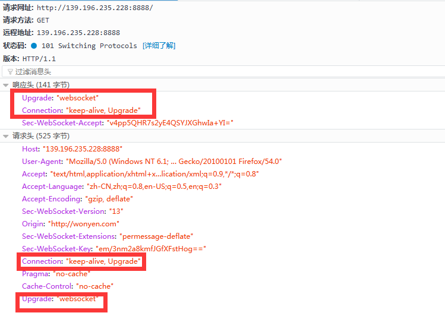
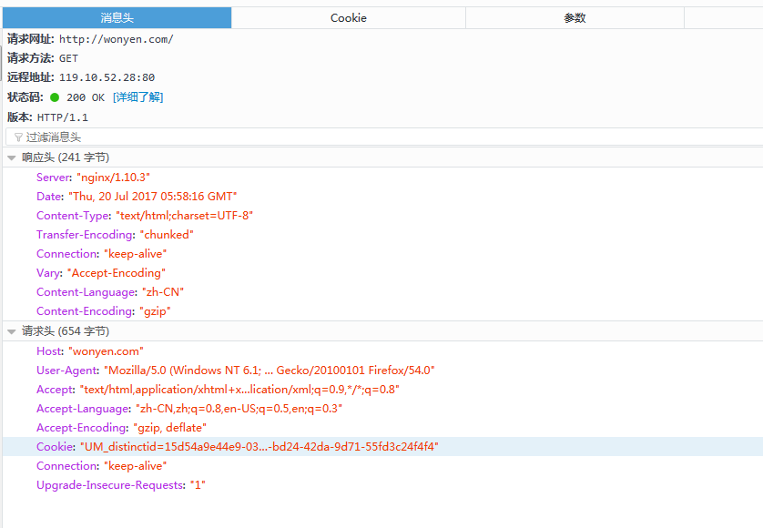

# 为什么需要 WebSocket？
初次接触 WebSocket 的人，都会问同样的问题：我们已经有了 HTTP 协议，为什么还需要另一个协议？它能带来什么好处？

答案很简单，因为 HTTP 协议有一个缺陷：通信只能由客户端发起。

举例来说，我们想了解今天的天气，只能是客户端向服务器发出请求，服务器返回查询结果。HTTP 协议做不到服务器主动向客户端推送信息。


这种单向请求的特点，注定了如果服务器有连续的状态变化，客户端要获知就非常麻烦。我们只能使用"轮询"：每隔一段时候，就发出一个询问，了解服务器有没有新的信息。最典型的场景就是聊天室。

轮询的效率低，非常浪费资源（因为必须不停连接，或者 HTTP 连接始终打开）。因此，工程师们一直在思考，有没有更好的方法。WebSocket 就是这样发明的。

# 简介

WebSocket 协议在2008年诞生，2011年成为国际标准。所有浏览器都已经支持了。

它的最大特点就是，服务器可以主动向客户端推送信息，客户端也可以主动向服务器发送信息，是真正的双向平等对话，属于服务器推送技术的一种。


其他特点包括：

（1）建立在 TCP 协议之上，服务器端的实现比较容易。

（2）与 HTTP 协议有着良好的兼容性。默认端口也是80和443，并且握手阶段采用 HTTP 协议，因此握手时不容易屏蔽，能通过各种 HTTP 代理服务器。

（3）数据格式比较轻量，性能开销小，通信高效。

（4）可以发送文本，也可以发送二进制数据。

（5）没有同源限制，客户端可以与任意服务器通信。

（6）协议标识符是ws（如果加密，则为wss），服务器网址就是 URL。

```
ws://example.com:80/some/path
```

在我们做web项目的过程中，经常需要做的一个模块是消息模块。典型的场景：一个商城系统的后台管理，我想实现如果前台有客户下单，后台就会接到消息，以便尽快发货处理。

要实现上述的功能，我们有几种备选的方案。

方案1.使用ajax短轮询，比如每隔1分钟去请求一次服务器，让服务器去数据库去查询，看看有无新的未处理的订单，然后返回给客户端。

方案2.长轮询，长轮询的原理与上述类似，只不过采取了阻塞响应（response）的方法，也就是说只要服务器没有响应，这个请求就不断开，一直等到服务器有响应为止。

ajax短轮询好比客户端每隔一段时间打一个电话给服务器，服务器不管有没有数据都要响应给客户端，响应完以后就挂掉电话，然后周而复始；

长轮询则是客户端打一个电话，开始一直等，直到服务器有响应，如果服务器一直不响应，这个请求就一直挂在那边。

很显然，这两种方案都有各自弊端。

方案1：每隔一定时间去轮询服务器，这个时间的设置很关键，太长了，即时性得不到保证，太短了，有可能会造成服务器性能的浪费（主要是cpu）,假设在一个小时之内都没有一个订单，但是客户端还是不间断的每分钟发一次请求，这些请求就是浪费。

方案2：方案2的出现本来是为了解决方案1这种盲目不确定地发送请求造成浪费的弊端，但是它自己同样也有弊端，首先，它采取阻塞的方式来强迫连接长时间保持，而对于服务器而言，在同一个时间里面能处理的连接数（我们称之为程序的并发数）是有限的，而长轮询方式很容易造成服务端达到并发的限制，因为它不像短轮询一样会很快释放掉连接。

它们的共同的缺点是，每一次请求和响应，处理处理真正有用的数据，服务器和客户端还要交换一堆请求头，响应头等东西，信息交换的效率不高。事实上可以说，长轮询是一种伪长连接，它还是需要遵循http连接的规则：客户端请求--服务器响应--释放连接，顺便交换了一些相同的无用的信息。（造成带宽浪费）

websocket的原理网上有很多人也介绍了，简单来说，它就是html5中的一种协议，我的理解是，他是对html的长连接的一种升级。你也可以将它理解成一种长连接。只不过这种长连接相对于方案2的长轮询有以下优越之处。
1.首先，websocket连接只需要建立一次，在第一次连接的时候，客户端和服务器会交换必要的信息，如下所示。


可以看到，websocket连接成功后返回的状态码是101.在请求头处，传递过来的connection类型是keep_alive，upgrade。也就是说是keep_alive的升级版。首先keep_alive是属于http1.1协议的范畴。大概的意思就是，在http1.0时代，我建立一个连接就是对应一次request--response的过程。而在1.1时代，新增加了keep-alive，我们可以保持这个连接的生命周期（可以通过nginx等服务器设置keepalive-timeout这个参数来实现），这样做的好处是可以自定义一个连接的存活时间，使得一个连接可以处理多个请求，而不是单单一次请求。设置了keepalive-timeout以后，当一个请求结束以后，我们在等keepalive-timeout这么长的时间，如果没有新的请求，就关闭这个连接。

说到http1.1，我们来看一个http的连接的请求头和响应头。

看到了吧，不一样的地方就在于那个upgrade。所以我们可以这么说，websocket也是一个长连接。但是因为它是升级版，所以它有个好处，就是它只需要建立一次连接，传递一次必要的请求头和响应头信息，之后再传递数据的时候就不需要在交换这些信息了。节省了带宽。

2.websocket是双向的，这也是他跟另外两种方法最大的不同，不管是ajax还是长轮询，他们都是通过客户端发送请求，服务器响应的形式完成信息的交换，这种模式下服务器处于一种被动的角色。而websocket不存在这个问题，websocket的链接一旦建立，服务器和客户端都可以互推信息。

有了这两个优点，在做一些需要即时通信的功能时候，我们首选就是用websocket。

# java中websocket的应用

场景：我做了一个商城系统，跟大多数商城系统，分为客户端和后台，客户端供客户浏览，下单，购买，后台主要管理商品，处理订单，发货等。我现在要实现的功能是，当客户端有客户下单，并且支付完成以后，主动推送消息给后台，让后台的人知道，好去处理发货等事宜。

首先，我们要知道websocket是一个连接，这个连接是客户端（页面）与服务端之间的连接，所以我们要分两部分来完成这个连接，服务端代码和客户端代码。

1.首先，在pom.xml引入如下jar包。

```
        <!-- websocket -->
        <dependency>
            <groupId>org.java-websocket</groupId>
            <artifactId>Java-WebSocket</artifactId>
            <version>1.3.0</version>
        </dependency>
```
2.然后我们要知道的是，websocket是客户端和服务端之间建立了一个连接，建立完连接以后，会生成一个websocket对象，我们可以用这个对象来执行发送，接收等操作。但是这只是一个存在于客户端与服务器之间的链接，换句话说，系统只能识别到这个websocket连接是对应于哪个页面（浏览器），而这个页面在系统中是对应哪个用户（数据库中的用户，或者根本就没有对应任何用户，即未登录，只是一个游客），我们是无法从这个websocket对象中获取的。所以我们需要创建一个Map对象，用于将websocket对象和实际的user对象进行关联，这样为我们后续向特定的用户推送消息做铺垫。

为此，我们创建一个WsPool，即websocket连接池的类，该类用于管理现实中的用户和websocket对象之间的关联。代码如下。

```
package com.xdx.websocket;

import java.util.ArrayList;
import java.util.Collection;
import java.util.HashMap;
import java.util.List;
import java.util.Map;
import java.util.Set;

import org.java_websocket.WebSocket;

public class WsPool {
    private static final Map<WebSocket, String> wsUserMap = new HashMap<WebSocket, String>();

    /**
     * 通过websocket连接获取其对应的用户
     *
     * @param conn
     * @return
     */
    public static String getUserByWs(WebSocket conn) {
        return wsUserMap.get(conn);
    }

    /**
     * 根据userName获取WebSocket,这是一个list,此处取第一个
     * 因为有可能多个websocket对应一个userName（但一般是只有一个，因为在close方法中，我们将失效的websocket连接去除了）
     *
     * @param user
     */
    public static WebSocket getWsByUser(String userName) {
        Set<WebSocket> keySet = wsUserMap.keySet();
        synchronized (keySet) {
            for (WebSocket conn : keySet) {
                String cuser = wsUserMap.get(conn);
                if (cuser.equals(userName)) {
                    return conn;
                }
            }
        }
        return null;
    }

    /**
     * 向连接池中添加连接
     *
     * @param inbound
     */
    public static void addUser(String userName, WebSocket conn) {
        wsUserMap.put(conn, userName); // 添加连接
    }

    /**
     * 获取所有连接池中的用户，因为set是不允许重复的，所以可以得到无重复的user数组
     *
     * @return
     */
    public static Collection<String> getOnlineUser() {
        List<String> setUsers = new ArrayList<String>();
        Collection<String> setUser = wsUserMap.values();
        for (String u : setUser) {
            setUsers.add(u);
        }
        return setUsers;
    }

    /**
     * 移除连接池中的连接
     *
     * @param inbound
     */
    public static boolean removeUser(WebSocket conn) {
        if (wsUserMap.containsKey(conn)) {
            wsUserMap.remove(conn); // 移除连接
            return true;
        } else {
            return false;
        }
    }

    /**
     * 向特定的用户发送数据
     *
     * @param user
     * @param message
     */
    public static void sendMessageToUser(WebSocket conn, String message) {
        if (null != conn && null != wsUserMap.get(conn)) {
            conn.send(message);
        }
    }

    /**
     * 向所有的用户发送消息
     *
     * @param message
     */
    public static void sendMessageToAll(String message) {
        Set<WebSocket> keySet = wsUserMap.keySet();
        synchronized (keySet) {
            for (WebSocket conn : keySet) {
                String user = wsUserMap.get(conn);
                if (user != null) {
                    conn.send(message);
                }
            }
        }
    }

}

```

3.接下来我们编写websocket的主程序类，该类用于管理websocket的生命周期。该类继承自WebSocketServer ，这是一个实现了runnable接口的类，他的构造函数需要传入一个端口，所以我们需要为websocket服务指定一个端口，该类有四个要重载的方法，onOpen()方法在连接创建成功以后调用，onClose在连接关闭以后调用，onError方法在连接发生错误的时候调用（一般连接出错以后触发了onError，也会紧接着触发onClose方法）。onMessage方法在收到客户端发来消息的时候触发。我们可以在这个方法中处理客户端所传递过来的消息。

```

package com.xdx.websocket;

import java.net.InetSocketAddress;

import org.java_websocket.WebSocket;
import org.java_websocket.handshake.ClientHandshake;
import org.java_websocket.server.WebSocketServer;

public class WsServer extends WebSocketServer {
    public WsServer(int port) {
        super(new InetSocketAddress(port));
    }

    public WsServer(InetSocketAddress address) {
        super(address);
    }

    @Override
    public void onOpen(WebSocket conn, ClientHandshake handshake) {
        // ws连接的时候触发的代码，onOpen中我们不做任何操作

    }

    @Override
    public void onClose(WebSocket conn, int code, String reason, boolean remote) {
        //断开连接时候触发代码
        userLeave(conn);
        System.out.println(reason);
    }

    @Override
    public void onMessage(WebSocket conn, String message) {
        System.out.println(message);
        if(null != message &&message.startsWith("online")){
            String userName=message.replaceFirst("online", message);//用户名
            userJoin(conn,userName);//用户加入
        }else if(null != message && message.startsWith("offline")){
            userLeave(conn);
        }

    }

    @Override
    public void onError(WebSocket conn, Exception ex) {
        //错误时候触发的代码
        System.out.println("on error");
        ex.printStackTrace();
    }
    /**
     * 去除掉失效的websocket链接
     * @param conn
     */
    private void userLeave(WebSocket conn){
        WsPool.removeUser(conn);
    }
    /**
     * 将websocket加入用户池
     * @param conn
     * @param userName
     */
    private void userJoin(WebSocket conn,String userName){
        WsPool.addUser(userName, conn);
    }

}

```

上述onMessage()方法中，我们接收到客户端传过来的一个message（消息），而这个客户端对应的websocket连接也被当成一个参数一起传递过来，我们通过message中携带的信息来判定这条信息对应是什么操作，如果是以online开头，则说明它是一条上线的是信息，我们就把该websocket和其对应的userName存入ws连接池中，如果是以offline开头，则说明websocket断开了，我们也没有必要维护这个websocket对应的map键值对，把它去除掉就好了。

4.如何在服务端开启这个socket呢。我们上面有说到WsServer的父类WebSocketServer 实现了一个runnable方法，由此可见我们需要在一个线程中运行这个WsServer，事实上，WebSocketServer 有个start()方法，其源码如下。

```
public void start() {
       if( selectorthread != null )
           throw new IllegalStateException( getClass().getName() + " can only be started once." );
       new Thread( this ).start();;
   }
```
