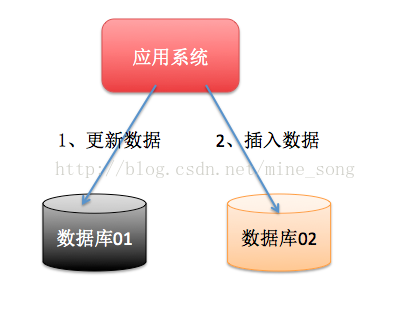
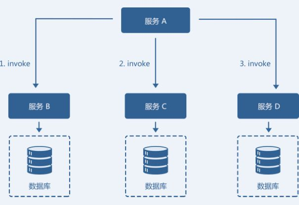

# 网络参考
http://blog.jobbole.com/110805/

https://blog.csdn.net/garfielder007/article/details/70515859

https://blog.csdn.net/kobejayandy/article/details/54783212

https://gitee.com/zhoubang85/zb-pay-dubbo

http://www.roncoo.com/article/detail/127500

http://www.roncoo.com/article/detail/124243

# 常见的分布式事务解决方案
事务可以分为柔性事务和刚性事务。

相同点：首先都是要保证数据正确（即ACID），本地事务与分布式事务还可以对应为：刚性事务与柔性事务，在我个人理解刚性事务与柔性事务的最大区别就是：一个完整的事务操作是否可以在同一物理介质（例如：内存）上同时完成；柔性事务就是一个完整事务需要跨物理介质或跨物理节点（网络通讯），那么排它锁、共享锁等等就没有用武之地了（这里并不是指大事务拆小事务【本地事务】后），无法保证原子性（Atomicity）完成事务。个人理解分布式（柔性）事务本质意义上就是-伪事务，柔性事务其实就是根据不同的业务场景使用不同的方法实现最终一致性，因为可以根据业务的特性做部分取舍，在业务过程中可以容忍一定时间内的数据不一致。

* 柔性事务满足BASE理论（基本可用，最终一致）     
分布式事务就是属于柔性事务。

* 刚性事务满足ACID理论
刚性事物特指数据库事务。对应于本地事务。

# 刚性事务
满足ACID理论的事务叫刚性事务。

ACID，指数据库事务正确执行的四个基本要素的缩写。包含：原子性（Atomicity）、一致性（Consistency）、隔离性（Isolation）、持久性（Durability）。一个支持事务（Transaction）的数据库，必须要具有这四种特性，否则在事务过（Transactionprocessing）当中无法保证数据的正确性，交易过程极可能达不到交易方的要求。

事务（transaction）是由指逻辑上对数据的的一组操作， 这组操作要么一次全部成功，如果这组操作全部失败，是不可分割的一个工作单位。

那么什么是ACID理论呢？

## 原子性

整个事务中的所有操作，要么全部完成，要么全部不完成，不可能停滞在中间某个环节。事务在执行过程中发生错误，会被回滚（Rollback）到事务开始前的状态，就像这个事务从来没有执行过一样。

事务的原子性是指事务是一个不可分割的工作单位，这组操作要么全部发生，否则全部不发生。

##  一致性

一个事务可以封装状态改变（除非它是一个只读的）。事务必须始终保持系统处于一致的状态，不管在任何给定的时间并发事务有多少。在事务开始以前，被操作的数据的完整性处于一致性的状态，事务结束后，被操作的数据的完整性也必须处于一致性状态。

也就是说：如果事务是并发多个，系统也必须如同串行事务一样操作。其主要特征是保护性和不变性(Preserving an Invariant)，以转账案例为例，假设有五个账户，每个账户余额是100元，那么五个账户总额是500元，如果在这个5个账户之间同时发生多个转账，无论并发多少个，比如在A与B账户之间转账5元，在C与D账户之间转账10元，在B与E之间转账15元，五个账户总额也应该还是500元，这就是保护性和不变性

##  隔离性

隔离状态执行事务，使它们好像是系统在给定时间内执行的唯一操作。如果有两个事务，运行在相同的时间内，执行相同的功能，事务的隔离性将确保每一事务在系统中认为只有该事务在使用系统。这种属性有时称为串行化，为了防止事务操作间的混淆，必须串行化或序列化请求，使得在同一时间仅有一个请求用于同一数据。

可以简化理解，隔离：并发执行事务时，将所存储的信息看作是连续运行的（一个接一个）。

事务的隔离级别由底到高有
1. Read Uncommitted      
    最低的隔离级别，什么都不需要做，一个事务可以读到另一个事务未提交的结果。所有的并发事务问题都会发生。
2. Read Committed   
  只有在事务提交后，其更新结果才会被其他事务看见。可以解决脏读问题。
3. Repeated Read    
在一个事务中，对于同一份数据的读取结果总是相同的，无论是否有其他事务对这份数据进行操作，以及这个事务是否提交。可以解决脏读、不可重复读。

4. Serialization    
事务串行化执行，隔离级别最高，牺牲了系统的并发性。可以解决并发事务的所有问题。
通常，在工程实践中，为了性能的考虑会对隔离性进行折中。

其中只有serialization实现隔离性所有要求，在真正实现事务的隔离性。
但考虑到实践，为了性能，数据库厂商做出了这方面的妥协，让使用者可以选择隔离的级别。
不同的隔离级别可以解决不同阶段的问题，是层层递进，逐渐增强的关系。

隔离性为了解决的问题主要有三个(将事务的隔离级别和问题联系在一起理解)。
1. 脏读(Drity Read)：事务A修改了一个数据，但未提交，事务B读到了事务A未提交的更新结果，如果事务A提交失败，事务B读到的就是脏数据。
2. 不可重复读(Non-repeatable read)：在同一个事务中，对于同一份数据读取到的结果不一致。比如，事务B在事务A提交前读到的结果，和提交后读到的结果可能不同。不可重复读出现的原因就是事务并发修改记录，要避免这种情况，最简单的方法就是对要修改的记录加锁，这导致锁竞争加剧，影响性能。（另一种方法是通过MVCC可以在无锁的情况下，避免不可重复读。待了解。。）
Repeated Read可以解决不可重复读问题和脏读问题，但仍无法解决下面的问题。
3. 幻读(Phantom Read) : 在同一个事务中，同一个查询多次返回的结果不一致。事务A新增了一条记录，事务B在事务A提交前后各执行了一次查询操作，发现后一次比前一次多了一条记录。幻读仅指由于并发事务增加记录导致的问题，这个不能像不可重复读通过记录加锁解决，因为对于新增的记录根本无法加锁。需要将事务串行化，才能避免幻读。

Serialization解决了以上所有问题，但是性能效率较低。通常来说，事务隔离级别越低，所需持有锁的时间也就越短，并发性能也就越好。

常用的一些数据库隔离级别：
1. mysql      
MySQL数据库的InnoDB存储引擎是支持事务的引擎，其默认事务隔离级别为REPEATABLE READ（简称RR）。ANSI SQL标准下RR事务隔离级别是Degree 2.9999的隔离性，但是与ANSI SQL标准不同的是，InnoDB存储引擎在RR的事务隔离级别下就解决了幻读问题，从而实现Degree 3的隔离性要求，从而达到了真正隔离性的要求。对比其他数据库，要达到真正的事务隔离性要求，必须将事务隔离级别设置为SERIALIZABLE。换句话说，MySQL InnoDB的默认事务隔离级别可以理解为其他数据库的SERIABLIZABLE级别。

然而，从严格意义上来说，InnoDB的RR事务隔离级别的实现与传统的SERIALIAZABLE事务隔离级别还是有些不一样，这导致在某些特定场景下会给用户有错愕抑或不能接受的感觉，比如唯一索引列在一个事务中允许重复值存在。不过这并不会破坏事务的一致性，只要理解InnoDB存储引擎的锁与MVCC的实现，其实有些怪异的现象都好理解。

SNAPSHOT事务隔离级别

经典的SERIALIAZABLE事务隔离级别采用严格的两阶段锁（strict two-phrase lock，简称：STPL）实现，这也是Jim Gray在书中提及的方法。但是由于读写都需要上锁，这样导致在大部分情况下事务的性能都不如类似RC（READ COMMITTED）这样的事务隔离级别。

为了解决性能问题，最近越来越多的数据库开始支持SNAPSHOT事务隔离级别(简称SI)，如Oracle、PostgreSQL、Microsoft SQL Server数据库等。SI事务隔离级别貌似解决了Dirty Read、Unrepeatable Read和Phantom Read问题。可惜的是，其依然不符合真正隔离性的要求，其存在write skew的异常问题。2008年的SIGMOD大会上，有人提出了Serializable Snapshot Isolation（SSI），从而解决了之前SI事务隔离级别存在的问题。PostgreSQL9.1版本在此论文基础上实现了SSI事务隔离级别并做了相应的优化。此外，在2012年的VLDB大会上PostgreSQL发布了相应的论文，有兴趣的读者可以继续研究。

基于快照的事务隔离级别（不论SI还是SSI）性能较之经典的SERIALIZABLE事务隔离级别提升非常多，但其存在两个问题不容忽视。一是其会导致“错误”的回滚，因为其策略就是保证正确，虽然有时可能会误杀一些没有问题的事务。二是对于大事务的支持需要额外的内存保证，如果修改的数据量特别大，那么这可能会导致内存溢出的问题发生。但不论怎么说，SSI可能都是未来的一个默认事务隔离级别发展的方向。期待MySQL数据库也能尽快支持。

##  持久性

在事务完成以后，该事务对数据库所作的更改便持久的保存在数据库之中，并不会被回滚。

个事务一旦成功提交，它对数据库的改变必须是永久的，即便是数据库发生故障也应该不回对其产生任何影响。

# 柔性事务

* 描述一：分布式事务就是指事务的参与者、支持事务的服务器、资源服务器以及事务管理器分别位于不同的分布式系统的不同节点之上。以上是百度百科的解释，简单的说，就是一次大的操作由不同的小操作组成，这些小的操作分布在不同的服务器上，且属于不同的应用，分布式事务需要保证这些小操作要么全部成功，要么全部失败。本质上来说，分布式事务就是为了保证不同数据库的数据一致性。

* 柔性事务遵循BASE理论，以支付宝为例，它所说的柔性事务分为：两阶段型、补偿型、异步确保型、最大努力通知型几种。由于支付宝整个架构是SOA架构，因此传统单机环境下数据库的ACID事务满足了分布式环境下的业务需要，以上几种事务类似就是针对分布式环境下业务需要设定的。

## 分布式系统的BASE理论

* BASE理论
eBay的架构师Dan Pritchett源于对大规模分布式系统的实践总结，在ACM上发表文章提出BASE理论，BASE理论是对CAP理论的延伸，核心思想是即使无法做到强一致性（Strong Consistency，CAP的一致性就是强一致性），但应用可以采用适合的方式达到最终一致性（Eventual Consitency）。
BASE是指基本可用（Basically Available）、软状态（ Soft State）、最终一致性(Eventual Consistency)。

* 基本可用（Basically Available）
基本可用是指分布式系统在出现故障的时候，允许损失部分可用性，即保证核心可用。电商大促时，为了应对访问量激增，部分用户可能会被引导到降级页面，服务层也可能只提供降级服务。这就是损失部分可用性的体现。
* 软状态（ Soft State）
软状态是指允许系统存在中间状态，而该中间状态不会影响系统整体可用性。分布式存储中一般一份数据至少会有三个副本，允许不同节点间副本同步的延时就是软状态的体现。mysql replication的异步复制也是一种体现。
* 最终一致性（ Eventual Consistency）
最终一致性是指系统中的所有数据副本经过一定时间后，最终能够达到一致的状态。弱一致性和强一致性相反，最终一致性是弱一致性的一种特殊情况。
* ACID和BASE的区别与联系
ACID是传统数据库常用的设计理念，追求强一致性模型。BASE支持的是大型分布式系统，提出通过牺牲强一致性获得高可用性。

ACID和BASE代表了两种截然相反的设计哲学，在分布式系统设计的场景中，系统组件对一致性要求是不同的，因此ACID和BASE又会结合使用。


## 分布式事务的产生的原因

1. 数据库分库分表
当数据库单表一年产生的数据超过1000W，那么就要考虑分库分表，具体分库分表的原理在此不做解释，简单的说就是原来的一个数据库变成了多个数据库。这时候，如果一个操作既访问01库，又访问02库，而且要保证数据的一致性，那么就要用到分布式事务。



2. 应用SOA化
所谓的SOA化，就是业务的服务化。比如原来单机支撑了整个电商网站，现在对整个网站进行拆解，分离出了订单中心、用户中心、库存中心。对于订单中心，有专门的数据库存储订单信息，用户中心也有专门的数据库存储用户信息，库存中心也会有专门的数据库存储库存信息。这时候如果要同时对订单和库存进行操作，那么就会涉及到订单数据库和库存数据库，为了保证数据一致性，就需要用到分布式事务。


以上两种情况表象不同，但是本质相同，都是因为要操作的数据库变多了！不再是在单个数据库上操作了。
分布式事务，本质上是对多个数据库的事务进行统一控制，按照控制力度可以分为：不控制、部分控制和完全控制。不控制就是不引入分布式事务，部分控制就是各种变种的两阶段提交，包括消息事务+最终一致性、TCC模式，而完全控制就是完全实现两阶段提交。部分控制的好处是并发量和性能很好，缺点是数 据一致性减弱了，完全控制则是牺牲了性能，保障了一致性，具体用哪种方式，最终还是取决于业务场景。作为技术人员，一定不能忘了技术是为业务服务的，不要为了技术而技术，针对不同业务进行技术选型也是一种很重要的能力！
## 分布式事务的应用场景

1. 支付
最经典的场景就是支付了，一笔支付，是对买家账户进行扣款，同时对卖家账户进行加钱，这些操作必须在一个事务里执行，要么全部成功，要么全部失败。而对于买家账户属于买家中心，对应的是买家数据库，而卖家账户属于卖家中心，对应的是卖家数据库，对不同数据库的操作必然需要引入分布式事务。
2. 在线下单
买家在电商平台下单，往往会涉及到两个动作，一个是扣库存，第二个是更新订单状态，库存和订单一般属于不同的数据库，需要使用分布式事务保证数据一致性。


## 柔性事务的典型处理方式
常见的柔性事务分为四种，两阶段型、补偿型、异步确保型、最大努力通知型几种。

### 两阶段提交（2PC）型   
就是分布式事务两阶段提交，对应技术上的XA、JTA/JTS。这是分布式环境下事务处理的典型模式。

1.基于XA协议的两阶段提交
XA是一个分布式事务协议，由Tuxedo提出。XA中大致分为两部分：事务管理器和本地资源管理器。其中本地资源管理器往往由数据库实现，比如Oracle、DB2这些商业数据库都实现了XA接口，而事务管理器作为全局的调度者，负责各个本地资源的提交和回滚。XA实现分布式事务的原理如下：


总的来说，XA协议比较简单，而且一旦商业数据库实现了XA协议，使用分布式事务的成本也比较低。但是，XA也有致命的缺点，那就是性能不理想，特别是在交易下单链路，往往并发量很高，XA无法满足高并发场景。XA目前在商业数据库支持的比较理想，在mysql数据库中支持的不太理想，mysql的XA实现，没有记录prepare阶段日志，主备切换回导致主库与备库数据不一致。许多nosql也没有支持XA，这让XA的应用场景变得非常狭隘。


### 事务补偿型
TCC （补偿型）。
某业务模型如图，由服务 A、服务B、服务C、服务D 共同组成的一个微服务架构系统。服务A 需要依次调用服务B、服务C 和服务D 共同完成一个操作。当服务A 调用服务D 失败时，若要保证整个系统数据的一致性，就要对服务B 和服务C 的invoke 操作进行回滚，执行反向的revert 操作。回滚成功后，整个微服务系统是数据一致的。



* 实现关键要素：
服务调用链必须被记录下来。
每个服务提供者都需要提供一组业务逻辑相反的操作，互为补偿，同时回滚操作要保证幂等。
必须按失败原因执行不同的回滚策略。

* 幂等 重复调用多次产生的业务结果与调用一次产生的业务结果相同，简单点讲所有提供的业务服务，不管是正向还是逆向的业务服务，都必须要支持重试。因为服务调用失败这种异常必须考虑到，不能因为服务的多次调用而导致业务数据的累计增加或减少。


明眼一看就知道，TCC应该是三个英文单词的首字母缩写而来。没错，TCC分别对应Try、Confirm和Cancel三种操作，这三种操作的业务含义如下：

Try: 尝试执行业务：
```
完成所有业务检查（一致性）

预留必须业务资源（准隔离性）

```

Confirm: 确认执行业务:

```
真正执行业务

不作任何业务检查

只使用Try阶段预留的业务资源

Confirm操作满足幂等性

```

Cancel: 取消执行业务:
```
释放Try阶段预留的业务资源

Cancel操作满足幂等性

```

* 实现 在github上有一个tcc-transaction项目实现了补偿型事务。

### 异步确保型
比如可靠消息最终一致方案。

### 最大努力型
比如定期校对、非可靠消息方案。
