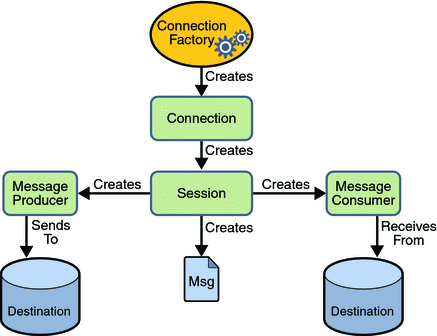

# 异步消息传递技术的比较：JMS、AMQP和MQTT

消息传递作为基本通信机制已经在全世界成功运用。无论是人与人、机器与人还是机器与机器之间，消息传递一直都是唯一常用的通信方式。在双方（或更多）之间交换消息有两种基本机制。

同步消息传递
异步消息传递
同步消息传递在这种情况下使用，当消息发送者希望在某个时间范围内收到响应，然后再进行下一个任务。基本上就是他在收到响应前一直处于“阻塞”状态。

异步消息意味着发送者并不要求立即收到响应，而且也不会阻塞整个流程。响应可有可无，发送者总会执行剩下的任务。

上面提到的技术，当两台计算机上的程序相互通信的时候，就广泛使用了异步消息传递。随着微服务架构的兴起，很明显我们需要使用异步消息传递模型来构建服务。

这一直是软件工程中的基本问题，而且不同的人和组织机构会提出不同的方法。我将介绍在企业IT系统中广泛使用的三种最成功的异步消息传递技术。

Java消息传递服务（Java Messaging Service (JMS)）
JMS是最成功的异步消息传递技术之一。随着Java在许多大型企业应用中的使用，JMS就成为了企业系统的首选。它定义了构建消息传递系统的API。

下面是JMS的主要特性：

面向Java平台的标准消息传递API
在Java或JVM语言比如Scala、Groovy中具有互用性
无需担心底层协议
有queues和topics两种消息传递模型
支持事务
能够定义消息格式（消息头、属性和内容）
